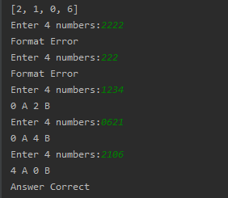

# X A X B 小遊戲
## 遊戲方式
* 1.電腦隨機選取0~9四個不重複數字
* 2.玩家輸入4位數字
* 3.數字正確即B+1，數字且位置正確則A+1
* 4.A=4即獲勝

## 程式邏輯簡介

* 一.檢查有幾A:
```python
    def A(ans_real, check):
    a = 0
    for i in range(4):
        if ans_real[i] == int(check[i]):
            a += 1
    return a
```

For loop四次檢查list內的數字及位置是否皆相同，是則A+1

* 二.檢查有幾B:
```python
    def B(ans_real, check):
    b = 0
    for i in range(0, 4):
        for j in range(1, 4):
            if ans_real[i] == int(check[i - j]):
                b += 1
    return b    
```
For loop每個數字以確認數字是否正確，數字正確則B+1

* 三.檢查有無格式錯誤:
```python
    def format(ans_real):
        for i in range(4):
            for j in range(i):
                if ans_real[i] == ans_real[j]:
                    return False
    return True 
```
若玩家輸入數字字數低於4位或有重複，則為格式錯誤

* 四.開始遊戲，電腦創建答案:
```python
    a = 0
    value = [i for i in range(0, 10)]
    ans_real = []

    for i in range(4):
        ans_real.append(random.choice(value))
        value.remove(ans_real[i])
    print(ans_real)
```
隨機四個數字加入list內，不會出現已出現過的數字

* 五.迴圈檢視:
```python
    while a != 4:
    while 1:
        ans_user = input("Enter 4 numbers:")
        if len(ans_user) == 4 and format(ans_user):
            break
        print('Format Error')
    check = list(ans_user)
    a = A(ans_real, check)
    b = B(ans_real, check)
    print(a, 'A', b, 'B')

print('Answer Correct')
```
無限迴圈檢視玩家輸入的答案，當A=4時即結束遊戲

## 遊戲畫面


